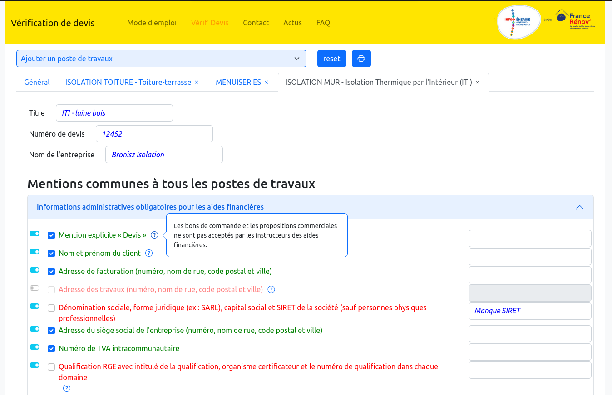
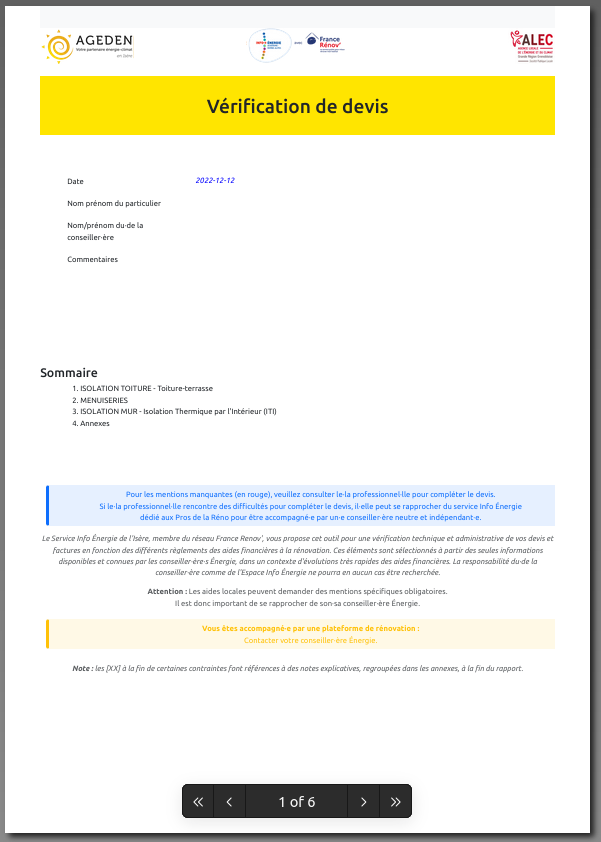

## Des devis conformes aux exigences des aides financières

Vous êtes arrivés ici, bravo :) et bienvenu !

Que cherchez-vous ?

- [Voir la version de l'EIE 38](https://www.infoenergie38.org/devis/index.php)
- [Avoir plus de détails sur l'application Verif' Devis](#app)
- [Contribuer à ce projet](#contrib), en reportant un bug, proposant une nouvelle fonctionnalité
- [Installer l'application pour ma structure](#install)
- [Regarder un cours sur l'électricité](https://www.youtube.com/watch?v=ienoSbONyhw) 😉

L'application Vérif'Devis 
============================
C'est une application web qui permet de **vérifier rapidement et simplement un devis pour une demande aide financière** (Ma Prime Rénov', CEE ou encore d'une aide locale).

Elle peut être utilisée par plusieurs publics :

- des conseillers énergies, pour vérifier le⋅s devis d'un client et générer un rapport PDF comme retour (possibilité de l'utiliser sur un acte SARE A3)
- des pros de la rénovation, pour vérifier leurs modèles de devis et savoir pourquoi une mention est obligatoire
- des particuliers, pour vérifier eux-mêmes leur devis

**👹 Différents profils** permettent d'avoir des contraintes réglementaires ainsi qu'un design et des logos différents selon le dispositif. Ainsi l'application et le PDF peuvent s'adapter aux différentes chartes graphiques de vos partenaires.

**🔧 Une interface d'administration simple** est accessible pour pouvoir facilement et simplement mettre à jour les contraintes règlementaires.

Enfin, pour toutes questions :
 - métier (sur la legislation, l'utilisation en tant que conseiller...), contacter : [prosdelareno@infoenergie38.org](mailto:prosdelareno@infoenergie38.org)
 - informatique (support technique ou encore demande d'amélioration), contacter : [verif-devis@caracals.org](mailto:verif-devis@caracals.org).

Exemple de rapport PDF : 

Cette application a été développée par l'AGEDEN38 et la SPL ALEC 38.

Comment contribuer ? 
====================
Vous avez un bug, une proposition d'amélioration, une erreur, des problèmes d'installation ou n'importe quelle autre demande ?

Soit, vous vous y connaissez en informatique et dans ce cas, ajoutez une issue ou même carrément un Pull Request sur Github.
Sinon, n'hésitez pas à nous contacter directement sur [verif-devis@caracals.org](mailto:verif-devis@caracals.org).

Installer l'application pour ma structure 
==============================

### Puis-je l'installer pour ma structure ?

Oui, bien sûr, les sources sont libres, sous la license CC-BY-NC-SA (pour plus d'info sur cette license [CLIC](https://creativecommons.org/licenses/by-nc-sa/2.0/fr/)).

Il faut juste avoir un serveur web avec les paquets zip et sendmail, pas besoin de base de données.

Et si vous l'installez, faites-le-nous savoir pour qu'on puisse vous tenir informer des nouveautés : [verif-devis@caracals.org](mailto:verif-devis@caracals.org)

🎵🎶 Cet outil a été développé pour que son utilisation ne nécessite quasi pas de compétence en informatique. Alors n'hésitez pas à le tester 😉  
<a href="https://wiki.bronisz.net/verif-devis" target="_blank">➡➡➡ Tester la démo ⬅⬅⬅</a>  
<a href="https://github.com/boonisz/verif-devis/archive/refs/heads/master.zip" target="_blank">📥📥📥 Télécharger l'application 📥📥📥</a>

### Comment adapter le code à sa structure ?
À venir...
En attendant, n'hésitez pas à prendre contact avec Alban : [verif-devis@caracals.org](mailto:verif-devis@caracals.org).

### Ça se passe comment pour les mises à jour ?

Cet outil nécessite deux types de mises à jour :

- les mises à jour réglementaires, pour suivre les évolutions des lois et des aides financières
- les mises à jour logicielles (le code de l'application).

Les mises à jour réglementaires sont faites, via une interface administrateur, par le⋅s référent⋅e⋅s de l'outil. Pas besoin d'avoir de grosses connaissances en informatique pour cette partie. Il suffit d'être suffisamment à l'aise avec un ordinateur, rigoureux et au courant des évolutions réglementaires.

Pour les mises à jour logicielles, c'est un peu plus technique. Grâce à un logiciel FTP style FileZila et avant toute chose, il faudra faire une sauvegarde du dossier `data`.
Ensuite pour les mises à jour mineures (version X.a à X.b), il faut simplement remplacer les fichiers (sauf ceux de `data`).
Pour les mises à jour majeures (version X.? à Y.?), il faudra alors bien lire la note de version pour ne pas rater une information importante.

🦉 Tu as : 
- 💡 une idée d'un outil qui pourrait être utile à ta structure et/ou à d'autres ? 
- 💻 envie d'un site internet ? 
- 🔧 besoin d'aide sur les outils numériques ? 
N'hésites pas à me contacter pour en discuter :  <a href="mailto:verif-devis@caracals.org">verif-devis@caracals.org</a>
🦉

Le coin des développeur·euse·s 
==============================

### Comment l'utiliser en local ?

**Sous Linux**, voici un exemple de commandes à lancer pour démarrer l'application localement.

    sudo apt install php-cli php-zip php-sqlite3 php-mbstring sendmail
    sudo php -S 127.0.0.1:80 -t .

Il faudra alors aller sur [127.0.0.1](127.0.0.1).

### Décisions de conception

- Par souci de simplicité, il a été choisi de ne pas avoir de mécanisme de sauvegarde d'une vérification en cours.
- Dans l'export en PDF, il n'y a pas de lien ancre entre les identifiants d'une annexe ([X]) et l'annexe correspondante, pour éviter un bug sur firefox ([Enable automatic URL hyperlinking #3172](https://github.com/mozilla/pdf.js/issues/3172)).
